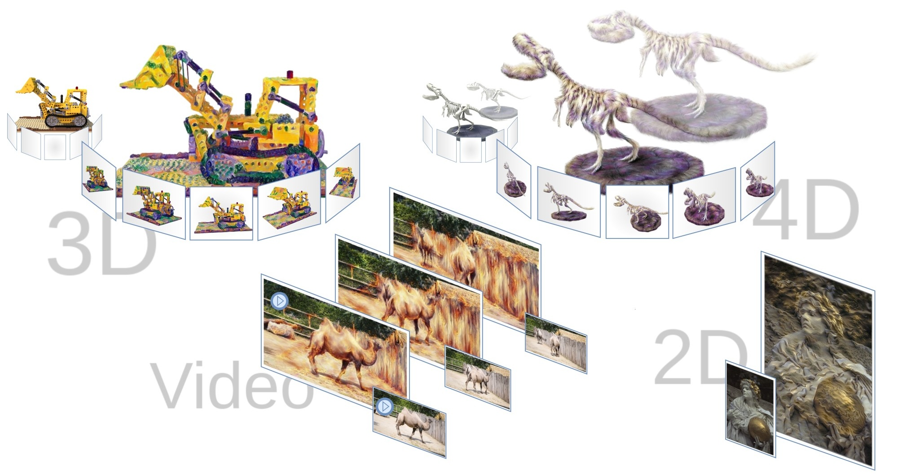

<h1>CLIPGaussian: Universal and Multimodal Style Transfer Based on Gaussian Splatting</h1>
Kornel Howil*, Joanna Waczyńska*, Piotr Borycki, Tadeusz Dziarmaga, Marcin Mazur, Przemysław Spurek

(* denotes equal contribution)

   

**Abstract:** Gaussian Splatting (GS) has recently emerged as an efficient representation for rendering 3D scenes from 2D images and has been extended to images, videos, and dynamic 4D content. However, applying style transfer to GS-based representations, especially beyond simple color changes, remains challenging. In this work, we introduce CLIPGaussians, the first unified style transfer framework that supports text- and image-guided stylization across multiple modalities: 2D images, videos, 3D objects, and 4D scenes. Our method operates directly on Gaussian primitives and integrates into existing GS pipelines as a plug-in module, without requiring large generative models or retraining from scratch. CLIPGaussians approach enables joint optimization of color and geometry in 3D and 4D settings, and achieves temporal coherence in videos, while preserving a model size. We demonstrate superior style fidelity and consistency across all tasks, validating CLIPGaussians as a universal and efficient solution for multimodal style transfer.

## ✅ Project Status
This repository contains work related to 4D, 3D, Video, and 2D object editing.
- [ ] Published for:
  - [x] 4D [Link](https://github.com/kornelhowil/CLIPGaussian/tree/main/4D)
  - [x] 3D [Link](https://github.com/kornelhowil/CLIPGaussian/tree/main/3D)
  - [x] Video [Link](https://github.com/kornelhowil/CLIPGaussian/tree/main/Video)
  - [ ] 2D
- [x] Project pages with examples
- [x] Paper published on arXiv
- [x] Paper accepted to NeurIPS 2025
<section class="section" id="BibTeX">
  

    <h2 class="title">Citations</h2>
If you find our work useful, please consider citing:
<h4 class="title">CLIPGaussian: Universal and Multimodal Style Transfer Based on Gaussian Splatting

</h4>
    <pre><code>@inproceedings{
  howil2025clipgaussian,
  title={CLIPGaussian: Universal and Multimodal Style Transfer Based on Gaussian Splatting},
  author={Kornel Howil and Joanna Waczynska and Piotr Borycki and Tadeusz Dziarmaga and Marcin Mazur and Przemys{\l}aw Spurek},
  booktitle={The Thirty-ninth Annual Conference on Neural Information Processing Systems},
  year={2025},
  url={https://openreview.net/forum?id=kjWB8iaO3l},
}
</code></pre>

</section>

## Acknowledgments
Our code was developed based on [gaussian-splatting](https://github.com/graphdeco-inria/gaussian-splatting) (3D), [D-MiSo](https://github.com/waczjoan/D-MiSo) (4D), [MiraGe](https://github.com/waczjoan/MiraGe/) (2D) and [VeGaS](https://github.com/gmum/VeGaS/) (Video).

The work of K. Howil, J. Waczy´ nska, P. Borycki, and P. Spurek was supported by the project Effective Rendering of 3D Objects Using Gaussian Splatting in an Augmented Reality Environment (FENG.02.02-IP.05-0114/23), carried out under the First Team programme of the Foundation for Polish Science and co-financed by the European Union through the European Funds for Smart Economy 2021–2027 (FENG). The work of M. Mazur was supported by the National Centre of Science, Poland Grant No. 2021/43/B/ST6/01456. We gratefully acknowledge Polish high-performance computing infrastructure PLGrid (HPC Centers: ACK Cyfronet AGH, CI TASK, WCSS) for providing computer facilities and support within computational grant no. PLG/2025/018296.

